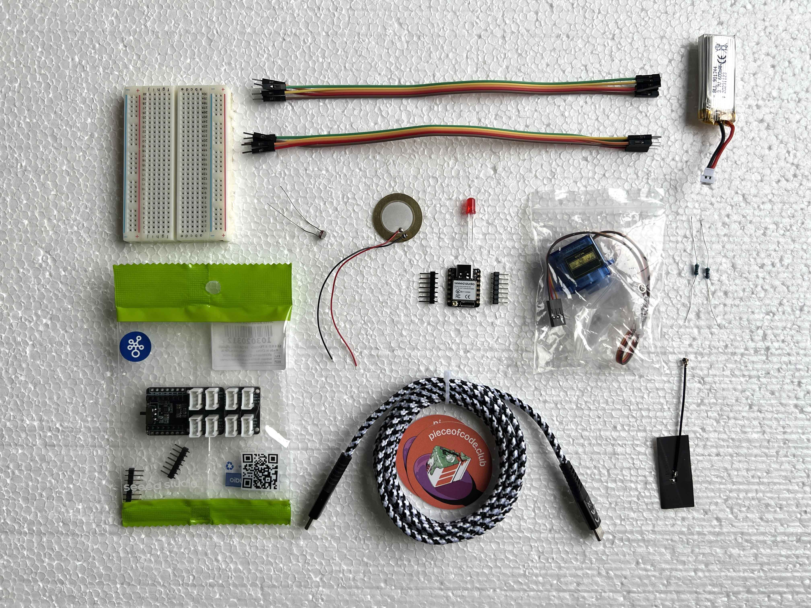
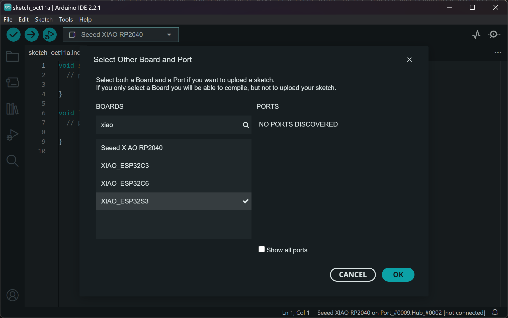

# Introduction

------------------------------------

## Workshop planning
**Workshop day 1 - 13:00-17:00**

Workshop day 1 | 13:00-17:00
--- | ---
13:00-13:15 | Walk in, welcome
13:15-13:45 | Introduction & presentation (examples of possible inputs/outputs, wearable fabrication techniques, interactions)
13:45-14:15 | Ideation, brainstorming, sketching
14:15-15:00 | Electronics & Arduino programming crash course focusing on your wishes! If you know electronics/programming already: get started!
15:00-15:15 | Break
15:15-16:45 | Prototyping circuits and (parts of) the wearable work of art
16:45-17:00 | Show & tell, clean up

Workshop day 2 | 13:00-17:00
--- | ---
13:00-13:15 | Walk in, welcome, what do you need to get started?
13:15-15:00 | Working on bringing the wearable art to life: bringing electronics & shapes together, making it wearable, integrating the circuit
15:00-15:15 | Break
15:15-16:30 | Finalizing prototypes: testing, troubleshooting, finishing touches 
16:30-17:00 | Wearable art show! Documenting results & reflecting on the process


Learning goal | How
--- | ---
Designing wearable things in 3D | Prototyping with various available materials and 3D techniques
Making electronics wearable | Integrating electronic circuits, using portable power options
Programming basics in Arduino IDE | Arduino IDE crash course - walkthrough for beginners
Basics of electronics | 'Sketching in hardware': prototyping electronics and learning by doing, trying out different inputs/outputs or deep diving into one


End of day 1 goals: 
- a clear idea for a wearable
- parts of the wearable without electronics done
- working programmed electronics (doesn't have to be wireless, soldered or final yet, just a first working iteration)  

End of day 2 goals:
- Making electronics wearable (starting together with this)
- 

------------------------------------

You can already make electronic wearables without a microcontroller. For example, you can use a coin cell battery (and optional coin cell battery holder with on/off switch) and an LED or LED filament and make something that emits light. You can even make it interactive by introducing an LDR (light dependent resistor) to the mix. But once you start using a microcontroller and programming, the sky is the limit!

## Soldering
Here is a soldering comic adaptation by Andie Nordgren that shows you the basics of soldering:


We are going to bring this to action with the header pins of the XIAO board, so we can easily prototype electronic circuits:


## Kit
You all received a kit with the following content:

- XIAO ESP32S3 + 2 sets of header pins
- 



-----
## Developing your wearable art concept 
### How to make things wearable?

0. What's your inspiration/reference? What's the concept, what do you want to say with your wearable piece of art? 

1. Pick your **body part** - are you making something for on your head? Around your arm? On your hand?
2. Pick your **input/output** - is it moving, emitting light or making sound? Is there an interaction: does it react to sound or dimming of light? Pick your electronics based on that.
    - Prototype your electronics on a breadboard
3. Pick your **materials** - what is it made of? Is it hard or soft? How do you attach it to the body? Prototype in 3D!
    - Make something from scratch, with patterns, elastic, straps
    - Build on something existing - i.e. on a glove or head band
        
## Integrating electronics into wearables
How do you go from a messy breadboard and wearable elements to electronics that you can wear? If you make something big, you often have some space to hide your electronics under something. If it's small, then you need other solutions. It's not always about how to make your circuit invisible, but rather how you can place your microcontroller and battery in relation to your input and output, in a way that looks natural or intentional. If you can't hide it, you can always make it part of the look! For example, if you want to make an earring with a motor, why not make another earring in which you can put your battery and microcontroller? Or you could have a microcontroller necklace that you can wear under your shirt, or on top if you make it look nice! If you make something to wear on your head, maybe you can hide your microcontroller and battery under a ponytail, or you can place the microcontroller and battery on a clip that you pin to the back inside of your shirt. 

And don't forget: we're prototyping, so it's also okay if it's not immediately the most efficient, optimal, final form of your wearable dreams. You have to start somewhere!

### Examples

- Embroidery, embedding electronics into soft circuits

[chainStitch Noise by Afroditi Psarra](https://etextile-summercamp.org/swatch-exchange/chain-stitch-noise/)


----

## Hardware & software

### What you need

System:
- Seeed Studio XIAO ESP32S3 development board
- Grove Shield for XIAO with battery management chip
- 3.7V Lithium battery
- USB-C cable to USB-C or USB-A (depending on the ports on your computer)

Output (options):
Motion:
- Micro servo motor
- Vibration motor

Light:
- LEDs
- LED filament 
- Neopixels

Sound:
- 8 Ohm speaker

Input:
- LDR
- Potentiometer
- Sound sensor
- Proximity sensor
- Self made sensor, with something like Velostat or a e-textile crafted sensor

-------

## Setting up the Arduino IDE
In these examples we're using a [Seeed Studio XIAO ESP32S3](https://wiki.seeedstudio.com/xiao_esp32s3_getting_started/). Their wiki is a great place to get started and acquainted with all of the possibilities this tiny development board has to offer. But first, we need to install some drivers. For both Mac and Windows, you can get them [here](https://www.silabs.com/developers/usb-to-uart-bridge-vcp-drivers?tab=downloads) (CP210x VCP Mac OSX Driver or CP210x Windows Drivers). For Mac, it can also work to just follow the steps below and then upload something to your ESP32 for the first time; there should be a prompt to install some drivers at some point.


For a quick start, follow these steps in the Arduino IDE (assuming you have it installed already; if not, download the latest stable version and launch it):

1. Navigate to ```File > Preferences```, and paste this URL in the 'Additional Boards Manager URLs': <https://raw.githubusercontent.com/espressif/arduino-esp32/gh-pages/package_esp32_index.json>
2. Now, navigate to ```Tools > Board > Boards Manager...```, type the keyword "esp32" in the search box, select 2.0.17 (the latest version, 3.x.x, does not work with the ESP32Servo library) and install it.
3. Plug in your board and select the board and port from the dropdown menu in the top left of the interface. Click on 'Select other board and port' and look for the XIAO_ESP32S3. 



That should be it! Now you can start uploading the example code or write your own. One thing to keep in mind with ESP32s is that sometimes they're in the wrong mode for programming. You can get back to boot mode by unplugging the board, then pressing and holding down the boot button on the board, then plugging it back in. Now it should work again :-)

## Basic setup
To prototype wearables, we're going to use the Grove Shield for XIAO, which makes trying things out very easy. You can even charge your lithium battery with it, so you don't need a separate charger for it. It's plug and play and you can snap off the smaller part of the base if you don't need it. You can always leave out the shield if it's too bulky for your final wearable once you know how you want to wire everything. 


To start out, we'll use the shield as a prototyping board together with a breadboard. You can plug in female jumper wires into the sockets to connect the data pins to your inputs and outputs, you can solder wires to the GPIO holes or you can solder sockets into the GPIO holes to plug in jumper wires for modularity. 

You can also just use the mini breadboard to start prototyping with, and leave the shield for later!

## Arduino code & circuits
Example code can be found in the ```Arduino (code)``` folder. You can find examples on programmed and external, digital, analog and touch input, combined with light, motion or sound output. Below you can find how you should wire up the circuits on a breadboard. This is also described in the Arduino code files. Find out how they work in the Arduino code files too!

### Programmed input
- Blinking an LED (light output, digitalWrite)
- Fading an LED (analogWrite, PWM)

Wire up your circuit on the breadboard like this:

<!-- 

Or directly on the breadboard like this: -->


Here is a video of what the output should be.

<div class="videowrapper"><video width="480" height="360" autoplay loop muted>
  <source src="{{ site.baseurl }}/assets/videos/fade0.mp4" type="video/mp4"></video>
</div>

If you connect the LED to an ESP32S3 on a Grove shield, the result is the same:

<div class="videowrapper"><video width="480" height="360" autoplay loop muted>
  <source src="{{ site.baseurl }}/assets/videos/fade1.mp4" type="video/mp4"></video>
</div>

### Digital input
- Using a momentary push button to turn on an LED (digitalRead, using internal pullup resistor)

Wire up your circuit like below. 


<!-- If your microcontroller is on the Grove shield, you can also wire it like this. Pay attention to the top left column of the bread board: we are using this column to combine two wires that both have to go to ground, since there is only one ground pin on the ESP32S3.

 -->

<!-- Note that the above is exactly the same as this: 

 -->

### Analog input
- Reading LDR sensor data (serial monitor)
- Using LDR sensor data to fade LED (mapping input values to output values)
- Using LDR sensor data to light up Neopixels (libraries)

For the LDR & LED examples, set up your circuit like below.


<!--  -->

Here you can see the expected interaction:

<div class="videowrapper"><video width="480" height="360" autoplay loop muted>
  <source src="{{ site.baseurl }}/assets/videos/fade-ldr.mp4" type="video/mp4"></video>
</div>

And for the Neopixel strip, wire it up like this:


Also an example when the ESP32S3 is on the Grove shield:


<!-- Here again the same circuit, but with the connections a little clearer:

 -->

- Sweeping a servo with LDR input (motion output)

Wire up like this:


<!--  -->

As a wearable, this is what you can do with a servo motor and an LDR!

<div class="videowrapper"><video width="480" height="360" autoplay loop muted>
  <source src="{{ site.baseurl }}/assets/videos/ldr-servo-example.mp4" type="video/mp4"></video>
</div>

If you've made the circuit with an LDR, it's only one step further to connect your own, self made sensor! Take out the LDR, and stick two jumper wires to alligator clip in where the LDR legs were.

### Touch input
- Turning on an LED with touch (touchRead, using input to do something with output, while statement)
- Toggling an LED with touch (if/else statement)
- Fading an LED with touch (touchRead, mapping capacitance ranges)
- Mapping a capacitance range to tones on a speaker (sound output, tone)
- Using touch pins to make a keyboard (multiple pins, arrays)

For the touch & LED examples, wire up the breadboard like below. The alligator clip can also be a male/male jumper wire, as long as there is something that you can touch.


Here a jumper wire is used; when you touch the end of the wire, the LED lights up.

<div class="videowrapper"><video width="480" height="360" autoplay loop muted>
  <source src="{{ site.baseurl }}/assets/videos/touch-led.mp4" type="video/mp4"></video>
</div>

The touch & speaker examples can be wired up like below; in this example it's with a buzzer but it also works with a piezo buzzer like in the kit!


<!--  -->

The touch range example sounds like this:

<div class="videowrapper"><video width="480" height="360" controls>
  <source src="{{ site.baseurl }}/assets/videos/touch-range-sound.mp4" type="video/mp4"></video>
</div>

You can also connect something conductive, like a conductive spool knitted sample. Now the interaction is way more interesting!

<div class="videowrapper"><video width="480" height="360" controls>
  <source src="{{ site.baseurl }}/assets/videos/touch-range-sound-etextiles1.mp4" type="video/mp4"></video>
</div>

And if you want more touch sensors, just plug in more wires in the touch pins you want to use. I moved the speaker to the other side now so all touch inputs are on one side.


## Circuit prototyping
For the LEDs, we are using a 68 Ohm current limiting resistor. The values for the resistor in series with an LED depend on a couple of factors (color, power supply voltage, current rating); 68 Ohm is based on a power supply voltage of 3.3V, an average voltage drop of 2V and a current rating of the LED of 20 mA. There's calculators for this online :-) If you use a bigger value resistor, it will still work, but the LED will shine a little less bright. If you use a smaller value resistor, the LED may shine a bit brighter, but it could also break in the long term (theoretically). 

## Useful links
- <https://docs.espressif.com/projects/arduino-esp32/en/latest/api/touch.html>
- [Wokwi: circuit & Arduino code simulation website](https://wokwi.com/projects/411276781876475905)
----

## Tools, techniques, machines & materials
Prototyping materials and techniques
- air drying modeling clay: clay modeling techniques & tools
- metal wire: jewelry making techniques, soldering 
- fabric & thread: sewing, textile craft techniques
- conductive fabric: soldering 

Creating three dimensional shapes with
- metal wire
- color filter sheets
- sewing machine zigzag

- Fabric
- Textile hardener

- Cardboard
- Hot glue

- Paper
- Origami & other folding techniques

- Paper
- Papier-mâché

- Metal wire frame
- Wrapping stretchy fabric around it

- Embedding electronic components in clay
- Sewing LEDs onto fabric 
- Glueing 

<!-- Step 1 - drawing out system of input and output before programming -->

## Output: motion

### Inspiration


Have a look at [this project called Kinetic Wearables Toolkit by the Social Body Lab at OCAD University](https://github.com/socialbodylab/KineticWearablesToolkit)! They are researching ways to incorporate motion and kinetics into wearables with 3D printed parts and various motors, including the servo motors that we are also using. I printed some of their parts so you can play around with it!


## Output: light

### Inspiration


[Second Skins Re-FREAM by Malou Beemer](https://www.maloubeemer.com/project/second-skins-re-fream/) shows integration of LEDs into garments, using textiles to diffuse the light. It also shows traces sewn with a sewing machine on the project page. 

